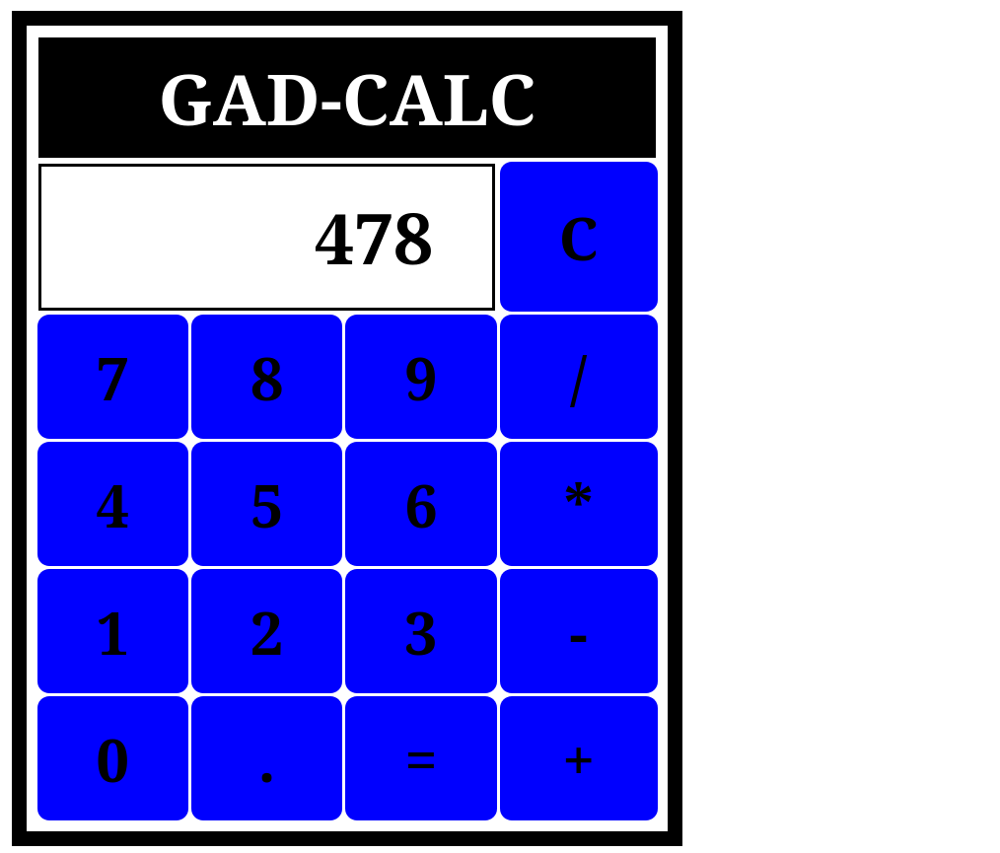

# brython-calculator

This calculator app is developed with intention of playing with Brython app, 
and It is capable of running in the browser using the Python programming language.

>This is not actually Python. it is Brython. 

I heard that Brython is designed to replace JavaScript as the scripting 
language for the Web browsers and Python 3 implementation.

It is adapted to HTML5 environment, which means that It works with the 
DOM objects and events.

## Requirements to run this:

You will need the following:
- Text editor or IDE such as PyCharm, 
- Web Browser such as Mozilla 
- Internet connectivity

## Brython Calculator Image



## Version Control
```git
echo "# brython-calculator" >> README.md
git init
git add README.md
git commit -m "first commit"
git branch -M main
git remote add origin https://github.com/Gadrawingz/brython-calculator.git
git push -u origin main

### Happy coding!